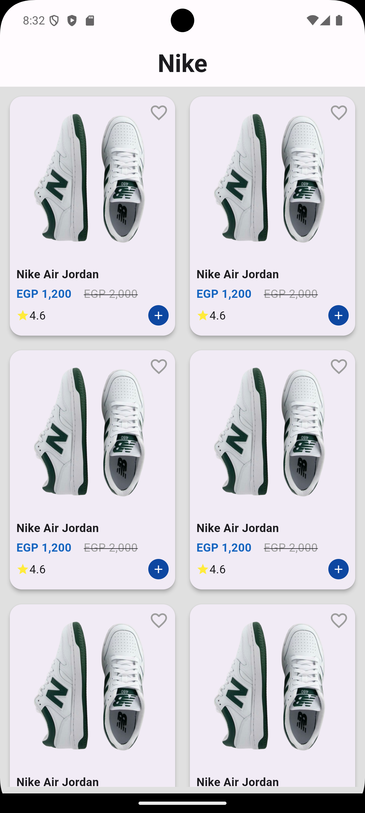

# Product List App

This project displays a list of products using the [Fake Store API](https://fakestoreapi.com/products).

## Screenshots

## Setup

1. Clone the repository
2. Run `flutter pub get` to install dependencies
3. Run `flutter pub run build_runner build` to generate code
4. Run the app using `flutter run`

## Architecture

- **MVVM Pattern**: Using Cubit for state management
- **Repository Pattern**: Implemented `ProductRepository` and `ProductRepositoryImpl`
- **Dependency Injection**: Configured using `injectable` and `get_it`
